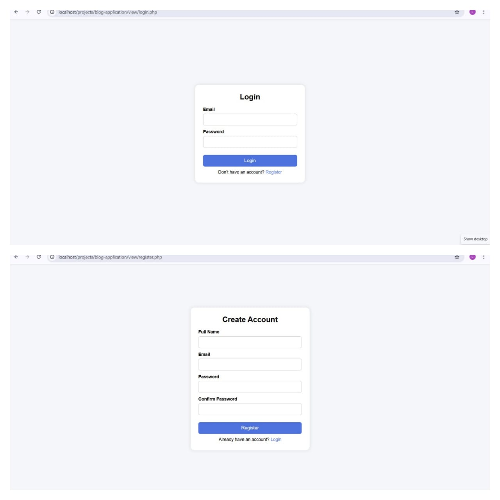

# Mini Blog Application

A simple blogging platform built with **Core PHP**, **MySQL**, and **Bootstrap 5**, where users can create posts, like, and comment.  

---

## Project Description

This is a **Mini Blog Application** where users can:

- Register and login to the system
- Create, edit, and delete their own posts
- Like other users' posts (one like per user per post)
- Comment on posts and edit/delete their own comments
- View their profile with total posts count and profile picture
- Search posts by username

---

## Features

- User authentication (Login / Logout)
- Create, edit, and delete posts (only by post owner)
- Like system (one user can like a post only once)
- Comment system (add, edit, delete comments)
- User profile page with profile picture and total posts count
- Search posts by username
- Secure file uploads (size restricted)
- Protection against SQL Injection and XSS attacks
- Responsive UI built with Bootstrap 5
- Modal confirmations for deleting posts/comments and logout.

---

## Installation
1. Clone the repository:
2. Import the `database.sql` file into your MySQL database.
3. Update the `config/Database.php` file with your database credentials.
4. Place the project in your web server (e.g., XAMPP `htdocs` folder).
5. Open the project in your browser: `http://localhost/<project-folder>/view/main.php`

## Screenshots
  
## Login & Registration Forms

## Main Page (Dashboard)

  

## Profile Page

## Create Post Page

## Search Result Page
